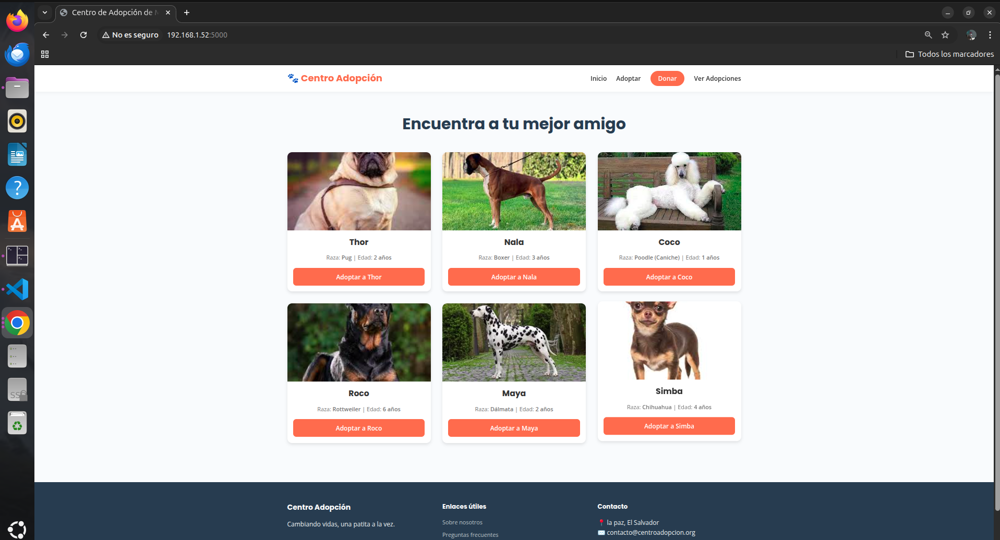
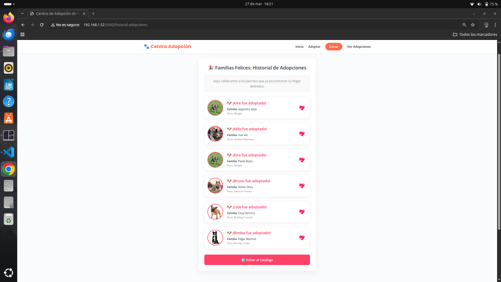
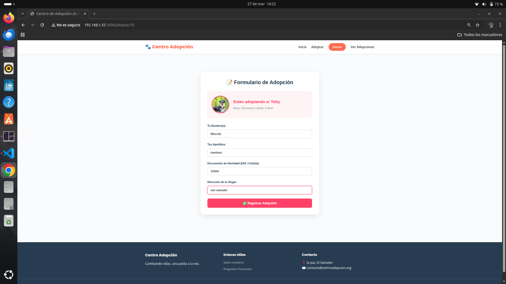
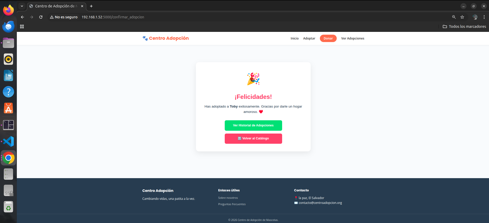

# 🐾 Centro de Adopción

<p align="center">
  
</p>

<p align="center">
  
  
  
  
</p>

<p align="center">
Sistema web desarrollado con Flask y MariaDB que permite gestionar un centro de adopción de mascotas, facilitando el registro, consulta y adopción de animales de manera eficiente 🐶💙
</p>

---

## 🎬 Demo

<p align="center">
  
</p>

👉 Simulación del funcionamiento del sistema de adopción de mascotas.

---

## 🌟 Vista del sistema

### 🐶 Catálogo de mascotas
<p align="center">
  
</p>

### 📋 Historial de adopciones
<p align="center">
  
</p>

### 📝 Formulario de adopción
<p align="center">
  
</p>

### 🎉 Confirmación
<p align="center">
  
</p>

---

## 🚀 Características

✔ Registro de mascotas  
✔ Catálogo de adopción  
✔ Historial de adopciones  
✔ Confirmación de adopción  
✔ Conexión a base de datos  

---

## 📌 Funcionalidades principales

- Gestión de mascotas disponibles 🐶  
- Registro de adopciones 📋  
- Visualización de historial 📊  
- Interfaz amigable 💻  

---

## 🛠️ Tecnologías

- 🐍 Python  
- ⚡ Flask  
- 🗄️ MariaDB  
- 🎨 HTML / CSS  

---

## 📦 Instalación

```bash
git clone https://github.com/emijazmincruzrojas-ux/Centro_Adopci-n.git
cd Centro_Adopci-n